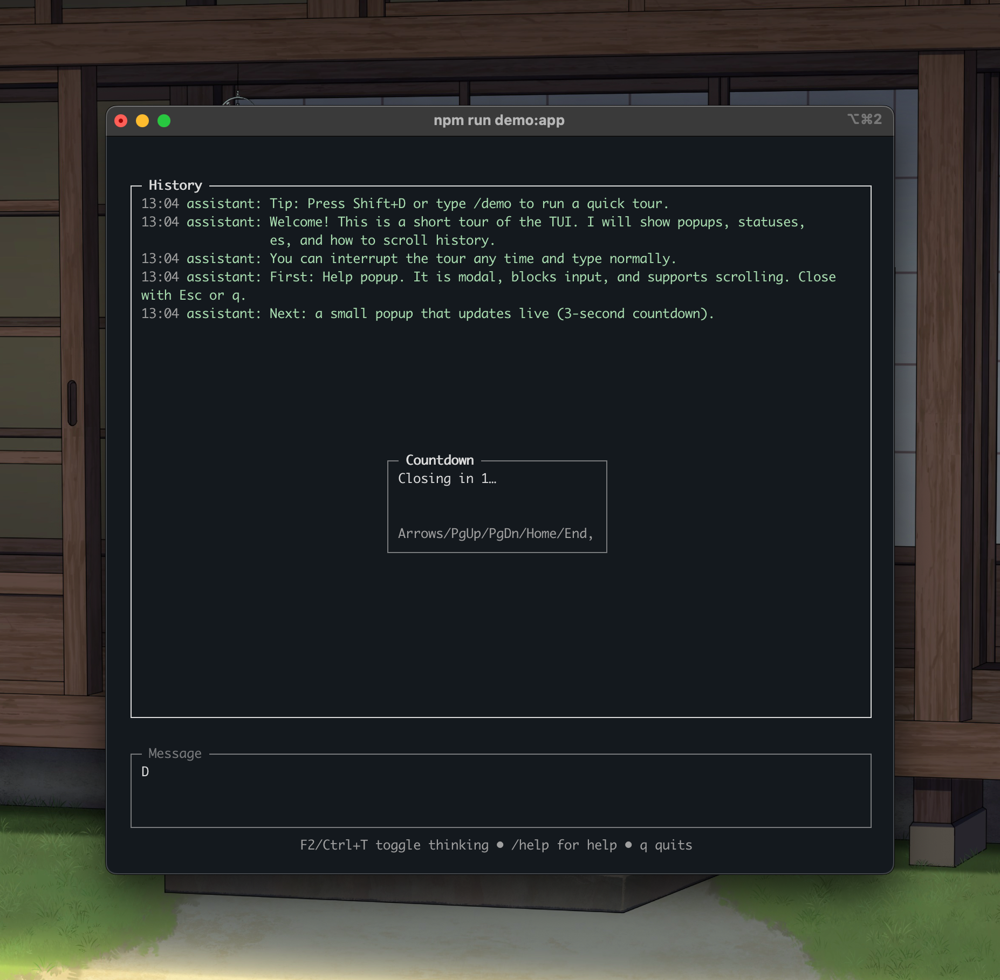

# Chikate

A small TUI library with a clean renderer and simple, readable APIs.



## Introduction
Chikate helps you build fast, flicker‑free terminal apps. It focuses on a deterministic renderer, sane input handling, and APIs that read like English.

## What Is Chikate?
- A tiny toolkit for terminal UIs.
- A diff‑based renderer for stable frames and clean resizes.
- A few widgets and facades that make common app flows straightforward.

## Principles
- Builder‑friendly: APIs that read like English (Page.full(...).margin(2).row()).
- Deterministic frames: no flicker, no surprises, predictable diffs.
- Resilient input: normalized keys, bracketed paste, focus routing.
- Minimal by default: opt‑in features; low ceremony.
- Built to evolve: stable core, optional sugar layers.

## Install
```
npm i chikate
```

## Runtime
- Node.js only (CommonJS). Tested on Node 18+.
- Runs in a terminal (macOS Terminal, iTerm2, Linux terminals, Windows Terminal/WSL).
- Not for browsers.

## Quickstart
```js
const { withApp, Page, widgets: { InputField, HistoryView }, OverlayStack, theme } = require('chikate');

withApp(({ screen, sched, stdin, keys, timers }) => {
  const history = new HistoryView({ title: 'History', showTimestamps: true });
  const input = new InputField({ title: 'Input', hint: 'Enter sends, Esc clears' });
  const overlays = new OverlayStack();

  // Layout and paint on each frame
  sched.on('paint', () => {
    const page = Page.full(screen).margin(1);
    const [top, bottom] = page.column(1).add({ minHeight: 6, flex: 1 }, { minHeight: input.measureHeightForWidth(screen.size().width) });
    history.paint(screen, top);
    input.cfg = { ...input.cfg, ...bottom };
    input.paint(screen);
  });
  sched.on('render', () => screen.endFrame({ cursor: input.getCursorScreenPos(), showCursor: true }));

  // Keys: route to input, add to history on submit
  keys.on('key', ev => {
    if (ev.name === 'Ctrl+C') return process.exit(0);
    if (input.handleKey(ev.seq)) {
      if (ev.name === 'Enter' && input.value) {
        history.push({ who: 'you', text: input.value, ts: Date.now() });
        input.setValue('');
        history.scrollToEnd();
      }
      sched.requestFrame();
      return;
    }
  });
});
```

## Public API (MVP)
- Core: `Screen`, `Scheduler`.
- Facades: `withApp`, `Page`.
- Input: `FocusManager`, `KeyParser`, `Keys`.
- Time: `TimerRegistry`.
- Overlay: `OverlayStack`.
- Widgets: `Box`, `Text`, `InputField`, `PopupOverlay`, `HistoryView`, `ThinkingIndicator`, `Logo`, `ProgressBar`.
- Utils: `wrapToWidth`, `measureWidth`, `times`.
- Theme: `getTheme`, `setTheme`, `cycleTheme`, `overrideTheme`, presets `DARK`/`LIGHT`/`LEGACY`.

API stubs live in `docs/framework/*`:
- Screen, Scheduler, Layout, Widgets, Theme, Input/Keys, Timer, History, withApp.

## Why Chikate?
- Flicker‑free cursor: hides only when needed; stable placement.
- Clean resizes: hard clear + immediate repaint; debounced follow‑up.
- Unicode wrapping: grapheme‑aware width; better emoji/CJK handling.
- Practical widgets: Input with suggestions, History with timestamps, popups, progress.
- Friendly sugar: `Page`, fluent builders (experimental), `Keys.map`, `times(n, fn)`.

## Terminal Compatibility
- Alt‑screen, cursor style (optional DECSCUSR), bracketed paste on by default.
- Mouse is planned; currently off by default.
- Resize via `process.stdout.on('resize')` with a debounced repaint.

## Versioning & Stability
- Start at `0.1.0` (semver). Core stays stable; sugar may evolve.
- Fluent builders are experimental; expect changes behind minor bumps.

## Examples
- See `examples/` for a guided demo, progress bar, key parser + timers, and a fluent quickstart.

## Docs
- Using the framework: `docs/using-the-framework.md`
- Rendering and resize: `docs/rendering-ideas.md`, `docs/resize.md`
- Principles: `docs/engineering-principles.md`, `docs/ousterhout-improvement-usability.md`
- Making a library: `docs/making-library.md`

## License
MIT (see package.json).
